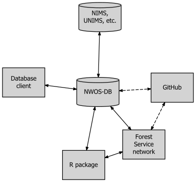

```{r setup, include=FALSE}
knitr::opts_chunk$set(
  echo = FALSE,
  collapse = TRUE,
  comment = "#>")
```

NOTE: This manual is a current and up-to-date version of a document currently in review for publication.

## Chapter 1 - Introduction

### Purpose of this Manual

This manual is intended to serve as the official guide to the National Woodland Owner Survey database (NWOS-DB). It serves two broad purposes. One is to provide guidance for the access, use, and interpretation of data by those with access privileges. At present time, this is limited to USDA employees and the small number of research partners with appropriate non-disclosure agreements. The second purpose is to provide transparency and reference for those interested in the operational and statistical methodology underlying the NWOS (Butler IN REVIEW, Butler et al. IN REVIEW)

This manual has four chapters. The remainder of chapter 1 provides a general introduction to the NWOS and NWOS-DB. It provides a brief summary of the place of the NWOS within the larger FIA program. It also provides an overview of the design philosophy behind NWOS-DB, as well the broader system of data and tools within which it functions. Chapter 2 provides a brief overview of the NWOS sample and the process of survey implementation. In a fundamental sense, these define the types of data that are stored in the database. Chapter 3 describes the tables that constitute the database, their functions, and the conceptual logic that links them together (definitions of each field and key in each table, including codes, are included in Supplement 1). Chapter 4 provides guidance on accessing NWOS data using the ‘nwos’ R package (Butler and Caputo 2019). It is hoped that this chapter provides sufficient guidance for a user to access NWOS data in a standardized and convenient format, given basic familiarity with R usage and syntax.

The names of tables and table fields (i.e. columns or attributes) are by convention capitalized in this report (e.g. PLOT_OWNER or OWNCD). In most cases, the association of a given field with a given table is clear given the verbal context (e.g. “In the SAMPLE table, the field NWOS_STUDY is used for…”). Where the association needs to be made explicit, the report uses a naming convention consisting of the table name followed by the field name, separated by a period (e.g. PLOT_OWNER.OWNCD).


### The National Woodland Owner Survey(s)

The NWOS is part of the USDA Forest Inventory and Analysis (FIA) program. It is one of the three primary components of the program, along with the Timber Products Output (TPO) survey and the core FIA plot-based forest inventory. The purpose of TPO is to provide estimates of wood products production; the survey is administered to primary wood products manufacturers and is designed to elicit the type and quantity of wood products produced as well as other attributes (Coulston et al. 2018). The plot-based inventory (sometimes referred to generically as “the” FIA sample) at its most basic consists of a national network of ground plots that are used to estimate “the extent, condition, volume, growth, and depletions of timber” (Burrill et al. 2017) across the entire United States, including affiliated territories (e.g. the Pacific Islands). The NWOS was developed to complement these other two components. Its intended purpose is to better understand the self-reported motivations, activities, intentions, and demographics of private U.S. forest landowners. The primary instruments of the NWOS are landowner questionnaires.

The main module^[A survey ‘module’ is also referred to more generally as a ‘survey’, or as a ‘study’ within portions of the NWOS database and associated literature.] of the NWOS (called the ‘base’ or ‘rural’ NWOS) has historically been tied to the network of FIA ground plots (excluding U.S. territories). The NWOS population of interest is private, forest landowners, and the survey stratum of interest is the subset of FIA plots that are both forested and privately owned, as determined by the plot-based inventory. Contact information associated with these FIA points is used to develop the NWOS mailing list. This approach has a number of advantages, including the adoption of a rigorous, pre-existing sample and the ability to link questionnaire responses back to measures of physical attributes of the land. When necessary to achieve adequate sample sizes, this base sample has been intensified using a complementary methodology (a more detailed description of the sampling methodology can be found in Chapter 2 or Westfall et al. IN REVIEW).

In recent history, FIA – including the NWOS – has been expanding its purview beyond rural, forests. A network of Urban FIA ground plots (similar to the standard network of ‘rural’ ground plots) has been established in multiple cities, in order to assess urban tree cover and forest resources. Subsequently, an urban version of the NWOS (the Urban National Landowner Survey) was piloted in multiple cities before being implemented fully in six cities in 2019. This survey is aimed at understanding the values, activities, and perspective of the private owners of urban green space.

The Urban National Landowners Survey is only the first of several new ‘flavors’ of NWOS studies that are in various stages of development. In 2019, a pilot test of the NWOS was administered to large corporate ownerships, defined as ownerships owning more than 45,000 acres (Caputo et al. 2017). This marked the first time that a separate, custom survey instrument was created for a specific substratum of the NWOS sampling frame. In the past, a single, generalized instrument was administered to family, corporate, non-profit, and other private ownerships alike. Moving forward, there is interest in creating customized survey instruments for all such substrata. Currently, surveys are being discussed or developed for island territories and tribal ownerships. In the future, similar efforts for other private forest ownerships, non-forest (i.e. “all-lands”) ownerships, or even public ownerships may be undertaken. NWOS-DB is being developed as a common repository for all surveys falling under the NWOS banner.


### The NWOS Database (NWOS-DB)

In this report, the word “database” refers to a group of multiple, interlinked tables with a common theme and common function, within the FIA’s production space, an Oracle instance (Oracle 12c.1) hosted on Forest Service servers. NWOS-DB consists of a group of tables belonging to a single schema (or user), FS_NWOS, within the FIA production space. Oracle is a relational database system, accessible through SQL (standard query language).

When designing any database structure, a primary consideration is the degree of normalization that will be pursued. Normalization is a foundational database concept that refers very generally to how disaggregated (or decomposed) data are among multiple tables. In a highly normalized database, one would generally find a greater number of (relatively simpler) tables with very specific logic relating them. This allows for reduced redundancy, reduced storage requirements, more optimized performance, and often greater flexibility in the types of data that can be accommodated. There is a tradeoff, however, between normalization and the overall accessibility of the underlying data. Highly normalized databases often require complex relations among tables, and users may find it very difficult to write terse, intuitive queries that correctly return the data the user requires. Views are one way to resolve this tradeoff. Views are essentially pre-established queries that run on-the-fly and that can be referenced like tables (without any redundancy in data storage). Views are often written by the database managers or creators and can be seen as official, ‘approved’ queries with the correct relations accounted for properly. Users can query views directly, often using simple, intuitive queries, while having some degree of assurance that their queries are ‘correct’, while the database still benefits from all the advantages of having a more normalized underlying table structure.

The NWOS database was deliberately designed with only a moderate degree of normalization. This main rationale behind this choice was the desire to create a simpler, more accessible structure for querying. Having only a few tables with simple and intuitive relations makes it easy to write queries that correctly return the data the user requires. Secondly, NWOS-DB is quite small and streamlined by industry standards and will likely remain so for the foreseeable future. The performance and storage benefits of further normalization do not outweigh the concomitant increase in complexity and loss of accessibility in any meaningful way. For similar reasons, NWOS-DB does not contain any built-in views. While this is partly because of the simple underlying table structure, it is largely because the database was designed to be primarily accessed – not through an SQL client – but through an R package containing a few simple, standardized functions. These functions provide many of the same benefits of database views. They allow users a simple, intuitive mechanism to download the data they want, with all of the joins made correctly and automatically behind-the-scenes (more on the package below).

NWOS-DB is to be seen as a work-in-progress and must remain responsive and flexible as the needs of the program evolve and as additional surveys and survey instruments are developed (see above). As the total amount and diversity of data increase, it is likely that additional normalization and the inclusion of views will be adopted. These will improve performance and flexibility, while remaining compatible with an access model in which an R package is used as the primary frontend and point of access. The tradeoff between normalization and simplicity will need to be continually assessed.

The raw NWOS data are not available publicly due to confidentiality concerns and the presence of personally identifiable information (PII). Access requires a Forest Service Oracle username with basic connection privileges. This username must also be granted an appropriate role within NWOS-DB. There are two such roles, ADMIN and ANALYST. The ADMIN role has full read and write privileges to all tables. This role is primarily intended for those directly involved in the uploading, cleaning, editing, and management of NWOS data. The ANALYST role, on the other hand, has only read (i.e. select) privileges and is intended for researchers and users of NWOS data. The ANALYST role is sufficient for accessing raw data using the R package (see below and Chapter 4 for step-by-step directions).


### The Database “Ecosystem”

As mentioned above, the database can be directly accessed through an SQL client (such as PL/SQL or SQL*Plus). Users with either database role will be able to run select queries on one or more tables. Users with the ADMIN role will also be able to update, insert, or delete records through the client. There are certain limitations to accessing the data this way. One is that – because of the absence of views – it is possible to relate tables incorrectly, resulting in datasets that may be mismatched to a user’s purpose. The second is that only ‘raw’ data are stored in the database itself. Weights, imputation sets, and other data sources used for making population-level estimates and analyses are stored outside the database. These data sources, along with tools for accessing, analyzing, and managing NWOS data, comprise a larger NWOS “ecosystem” (see Figure 1).

Within this ecosystem, the preferred method for accessing the database (particularly for users with the ANALYST role) is through the ‘nwos’ R package. This package, freely available through GitHub (https://github.com/familyforestresearchcenter/nwos), allows an authenticated user to access the raw plot-level, sample-level, and questionnaire-level NWOS data. These are downloaded to a user’s computer in the form of a custom R object (of type ‘nwos.object’), which also contains sample weights, imputation sets, and metadata. Additional functions allow users the abilities to generate ‘wide’ or ‘long’ datasets, generate metadata tables, run population-level estimates, or complete datasets (i.e. append weights and imputed values) for statistical analyses. There are also functions for exporting datasets, accessing the complete and up-to-date database catalog, and other purposes. For users with the ADMIN role, the package also contains functions for inserting, updating and deleting data in the database. Chapter 4 provides additional information on using the ‘nwos’ package to access the database, including step-by-step guidance on many of the key functions.

The ‘nwos’ package accesses a number of data tables other than those stored in the database itself. These are stored on the Forest Service network, along with a large library of additional scripts used in the implementation of the NWOS. This library can also be found in a repository on the Forest Service’s internal GitHub (https://code.fs.usda.gov/forest-service/FS_NWOS). This repository also contains the scripts used to define, create, and update the database in the Oracle production space; as well as an up-to-date version of this manual.

Finally, NWOS-DB can be directly joined to tables in other FIA databases (NIMS, UNIMS, etc.) from within the Oracle production space (see Chapter 3 for more about these linkages).


```{r fig1, out.width="600px",fig.align="center"}

```

**Figure 1. Relationships among elements in the NWOS-DB “ecosystem”. Data is accessed directly through a database client (e.g. PL/SQL, SQL\*Plus) or by using the ‘nwos’ R package. The database is updated in turn through the use of the same package, through the client, or through implementation scripts stored on the Forest Service network. A repository on the internal Forest Service GitHub contains a copy of these implementation scripts as well as the scripts and tools defining the database. Linkages to NIMS, UNIMS, and other FIA databases can be made directly from within the Oracle production space. Solid lines refer to transfer of data. Dashed lines refer to transfer of scripts/code.**

## Chapter 2 – NWOS Sampling and Implementation

The primary sampling unit (PSU) of the base NWOS is a zero-dimensional sample point (Westfall et al. IN REVIEW). These points are derived from two different sources: FIA field plots and augmented/intensified sampling points. The FIA field plots, often called Phase 2 or P2 plots from the three-phase sample design adopted by FIA (Bechtold and Patterson 2005), are distributed nationwide using a hybrid of random and systematic sampling approaches. First a hexagonal sample frame is established across the U.S. Within each cell of this grid, a single sample point is located randomly. At each *point*, a tri-areal (i.e. containing nested macroplots, subplots, and microplots) measurement *plot* is established. Each measurement plot contains one or more condition classes, defined by a discrete combination of land use, forest type (if forested), ownership group, and other condition class variables (see Bechtold and Patterson 2005 for a complete description of the FIA sampling design). In order to determine the land use of a given condition class, FIA has established the following definition of ‘forest’: *“Land that has at least 10 percent crown cover by live tally trees of any size or has had at least 10 percent canopy cover of live tally species in the past, based on the presence of stumps, snags, or other evidence. To qualify, the area must be at least 1.0 acre in size and 120.0 feet wide”* (USDA Forest Service 2016).

The nucleus of the NWOS sample is derived from the measurement (i.e. P2) plots. These are stratified by the land use and ownership group of the first condition, which is conventionally located at the center of the measurement plot. The main stratum of interest consists of those plots which are determined to be forested and privately owned. Since only the attributes of the (nominal) plot center are relevant to the NWOS, each sample *plot* is in effect no more than a sample *point*. For the sake of consistency, then, the term sample point will be used in the remainder of this report. Similar sampling designs have been adopted for Urban FIA (and consequently, the UNLS), albeit with different sampling intensities (i.e. different grid sizes) and condition class definitions.

In 1999, FIA switched its sampling methodology from a periodic one to an annual one, in which a random subset of plots (i.e. a panel) is measured each year such that any individual year or group of years within a cycle constitutes an independent sample. Starting in 2019, an annual sampling methodology was established for the NWOS, using P2 data from two years prior as the core of the sample. For periodic surveys (2018 and earlier), the NWOS sample is organized around a survey ‘cycle’ – a period of ~5 years that constitutes an independent sample. At least initially, annual surveys are also organized around a 5-year survey ‘cycle’ for operational reasons, even though each year or group of years also constitutes an independent sample.

In addition to those points derived from FIA field plots, the NWOS sample also contains augmented and/or intensified points. These both refer to additional sets of sample points generated exclusively for the NWOS (i.e. they are not associated with any ground plots), in order to increase the sample size. Augmented points are generated simply to increase the base sample to an adequate size; intensified sample points are generated for special projects, including implementation of custom versions of the base instrument. The terms intensified points and intensification will be used hereafter to refer to both. The process of intensifying the sample frame is similar to the process for locating the original FIA sample points. A hexagonal grid with smaller cell size is overlaid on the initial FIA grid, and one points is located randomly in each empty (i.e. not containing a P2 point) cell. These additional points are iteratively added to the sample until the desired intensity is achieved.

The secondary sampling unit (SSU) for the NWOS is the ownership – a group of one or more owners that jointly own land. Ownerships may be associated with more than one sample point, but will receive only one survey for a given survey spatial unit (i.e. city for the ULNS or state for the base NWOS). Therefore, the sample contains fewer unique ownerships than sample points. Points derived from P2 plots are already associated with owner names and contact information; in the case of intensified points, these are derived from commercial data vendors. Ownerships may be part of the sample for multiple cities/states. Each ownership sampled^[The term sample has more than one meaning in this report. It refers in a strict sense to the entire set of sample points and ownerships (regardless of land use and ownership). It also refers in a more general sense to the substrata of interest, those landowners who actually received questionnaires (e.g. for base NWOS, private owners of forested land). The name of the SAMPLE table (see Chapter 3) is predicated on this second meaning.] is mailed two questionnaires according the Tailored Design Method (Dillman, Smyth, and Christian 2014), with an option to respond to a web-based version of the questionnaire. A given ownership may only received a single questionnaire if they answer quickly enough (and consequently are removed from the second mailing), or more than two if they opt to submit the electronic version. A subset of non-respondents is also contacted for a phone interview, primarily for post-hoc non-response assessment. More information on the implementation of the NWOS, including information on weighting and estimation procedures, can be found in Butler (IN REVIEW) and Butler et al (IN REVIEW).


## Chapter 3 – Database Structure

This chapter provides information about the structure of NWOS-DB. A copy of the database catalog, including detailed descriptions of all fields in each table, is included in Supplement 1 and is also accessible in an up-to-date format through the ‘nwos’ R package (see Chapter 4). Each field (also known as a column or attribute) is listed in these documents, including a description. For those fields that are coded, a list of the codes and their meanings is included as well.

Each table includes one primary key titled ‘CN’ (for control number). Foreign keys reference the primary key of the table to which they join (e.g. ‘PLOT_OWNER_CN’, ‘SAMPLE_CN’). Keys are character fields and consist of unique numbers predicated by a three-digit code that is specific to each table. For example, the first value of RESPONSE.CN is ‘RES1’. These table-specific prefixes are listed in Table 1. Keys for each table are also described in Supplement 1.

**Table 1. Table-specific primary key prefixes in NWOS-DB. Each value of a table’s primary key consists of the appropriate prefix followed by a unique number.**
```{r table1, echo=FALSE}
library(knitr)
kable(data.frame(Table=c("CODES", "CONTACTS", "FIELDS", "MODIFICATIONS", 
"NOTES", "OWNER", "PLOT_OWNER", "QUEST", "QUEST_METADATA", "QUEST_TEXT", 
"RESPONSE", "SAMPLE", "TABLES"),
Prefix=c("COD", "CON", "FLD", "MOD", "NOT", "OWN", "PLT", 
"QMD", "QST", "RES", "SAM", "TAB", "TXT")),row.names=F)
```

### Table Descriptions

There are 13 data tables in the database in two table groups, administrative tables (five tables) and survey tables (eight tables). The latter contain data pertaining to the sampling frame, survey organization, and questionnaires. Administrative tables contain database-level metadata as well as notes and modification records for the entire database. All tables belong to the FS_NWOS schema. Figures 2 and 3 illustrate the relationships among these tables.

The eight survey tables are:

* PLOT_OWNER table – contains one record for each sample point in an NWOS study. Each record contains point-level attributes (e.g. coordinates, land use) as well as the original (un-edited) ownership information for that point. This table contains all sample points for all studies. As such, data originate from multiple sources, including other FIA databases and commercial ownership data products (for intensified points). Where data for P2 (and urban) points originate from other FIA databases in the production space (e.g. NIMS, UNIMS), it is possible to directly link these tables to the PLOT_OWNER table. PLOT_OWNER contains a number of foreign keys in order to facilitate these joins. These keys are what make it possible to link NWOS survey responses back to plot and condition-level FIA data, including tree inventory data. More information on these keys is contained in Supplement 1. More information on the tables to which these keys join can be found in Burrill et al. 2017. Despite the presence of foreign keys linking the PLOT_OWNER table to plot, condition, and ownership tables elsewhere in the production space, copies of the raw data from these tables are stored directly in PLOT_OWNER. This redundancy was deliberate, as it makes it possible to fully analyze NWOS data without joining to tables outside of FS_NWOS. This is useful if an NWOS user is unfamiliar with these tables or does not have sufficient privileges to access them. This also means that a locked-down version of the primary NWOS sample is maintained, even if the original data are dropped or altered for any reason. Finally, it allows for a consistent format for the storage of data originating from within and without FIA in the same table.
* OWNER table – contains one record for each unique ownership associated with one or more valid sample points in PLOT_OWNER. Owner-level attributes such as owner type, industrial status, and whether or not an ownership should be contacted are stored in this table. Names and address fields in this table are cleaned and formatted to appear on mailing labels (raw, point-level versions of these fields are stored in PLOT_OWNER). Where names and contact information are incomplete or unknown, the OWNER table contains a dummy record containing null data. This is necessary because the OWNER table is the link between the sample points (contained in PLOT_OWNER) and the SAMPLE table (see below). Thus, all valid sample points are associated with an ownership – even if the details of that ownership are unknown and cannot be surveyed. Where the same ownership is associated with plots in more than one study or study unit^[Study unit refers generally to a spatial unit within which an independent sample has been established. In the case of NWOS, the study unit is the state. In the case of the urban survey, the study unit is the city.], there may be separate OWNER records for each. 
* SAMPLE table – contains one record for each unique ownership in the sample of a given study, year/cycle and spatial unit (e.g. state). For example, in the base NWOS, there is a record in SAMPLE for each unique ownership in each state that owns one or more private, forested plots in that state. By joining the SAMPLE table with the cleaned contact information in OWNER and filtering out the ownerships that should not be contacted or for whom there is no contact information (‘dummy’ ownerships, see above), it is possible to generate a mailing list for mailing out questionnaires.
* CONTACTS table – records the occurrence and progress of official contacts with survey recipients. This includes phone calls, emails, and letters. The mailing and receiving of survey instruments (the most numerous form of ‘contact’) are recorded in the RESPONSE table (below).
* RESPONSE table – contains one record for every survey instrument sent or administered to an ownership as part of a given sample. In most cases, there will be at least two records (i.e. two survey instruments) associated with each ownership. In some cases, there will be only one (if the first is returned before the second batch is mailed) or more than two, if an ownership responds to a phone or web-based instrument. Each record contains information about the mode of the instrument, the dates sent or administered, and the dates received. Additional fields record whether an instrument prompted a valid response and, if not, the type of non-response (e.g. undeliverable, refusal, etc.). By joining the RESPONSE table to the SAMPLE table, it is possible to calculate response and cooperation rates for a study (see Butler et al. IN REVIEW). 
* QUEST_METADATA table – contains one record for each unique question asked in one or more survey instruments. This table contains the text of the questions, their type (e.g. open-ended, check box, text box, etc.), the factor levels of categorical questions, and the units of continuous questions. Additional fields contain the questions’ allowable range, data type (e.g. numerical, character, etc.), whether they are part of a check box grouping, and whether they are dependent (i.e. skip-pattern) questions. Although the QUEST_METADATA table is partly intended to be a reference guide for interpreting survey results, it also serves a central role in the processes of data cleaning and logic checks (Butler et al. IN REVIEW). By comparing each question response to the fields in QUEST_METADATA, implementation scripts automatically identify and (in some cases) correct responses that are out of range or that demonstrate illogical dependencies (e.g. skip-pattern errors). There is an inherent many-to-many relationship between survey instruments and survey questions (i.e. an instrument contains many questions and a question may appear in more than one instrument). By joining the QUEST_METADATA table to the RESPONSE table on an instrument’s identifier field, it is possible to identify all of the questions that were contained in the instrument or instruments administered to an ownership in a given sample. 
* QUEST table – contains one record for each individual response to a question in a survey instrument. The QUEST table contains what is usually meant when a user refers monolithically to ‘the’ NWOS data – the actual response values from returned questionnaires. For a number of reasons, however, this table should not be queried and analyzed independently of other tables. The QUEST table is one of the larger tables in the database and a deliberate choice was made to pursue a greater degree of normalization with this table than with many others. The table itself contains mostly foreign keys and a single field containing response values. It is necessary to join this table to QUEST_METADATA in order to determine factor levels, recode responses, identify appropriate data types, etc. The QUEST table also contains the responses to all returned questionnaires, regardless of study, cycle, or sample unit. Furthermore, valid and invalid (or incomplete) surveys are stored alike (see Butler et al. IN REVIEW for more about what constitutes a valid survey). In order to query only the valid responses associated with a particular study, it is necessary to join QUEST to RESPONSE and SAMPLE. Making this join correctly is one of the primary functions of the ‘nwos’ R package (see Chapter 4), the recommended means of accessing the QUEST table.
* QUEST_TEXT table – contains text of comment/text fields in questionnaires. In order to reduce the size of the QUEST table, responses to open-ended text and comment fields are not stored in the QUEST table. Instead, these values are recoded on a binary scale indicating whether or not a response was provided by the respondent. Where responses were provided, the actual text of the response is stored in the QUEST_TEXT table. This improves the efficiency of working with the QUEST table, particularly as the comment field data is rarely used.  The same structural relations that exist between the QUEST table and the SAMPLE and RESPONSE tables also exist between these tables and QUEST_TEXT.

The five administrative tables are:

* MODIFICATIONS table – records details of modifications to individual table cells or groups of cells. These records include the date of the modification(s), a description of the modification(s) (including reasons for making them), the names of any scripts that were used, and the new and old values of the cell or cells. The modifications table can be joined to any other table, using two fields – one referencing the table modified and the other referencing the record-level CN. Where modifications refer to individual cells, records usually contain non-null values referencing the tables, records, and fields that were modified, as well as non-null values for the old and new (i.e. modified) data. In these cases, the MODIFICATIONS table can be used to roll back modifications to an earlier state. Where modification records refer more broadly to modifications across multiple tables, records, or fields, many of these attributes will be left null. 
* NOTES table – contains notes on records in all tables. Notes can be recorded for any record in any table, using a two-field key (similar to the MODIFICATIONS table, above). Consequently, notes can be joined directly to their associated records in a query.
* TABLES table – contains one record for every table in the database. This metadata table stores the name, type (survey vs. administrative), and description of every data table in the database.
* FIELDS table – contains one record for every field in every table in the database. This metadata table contains the name, description, and Oracle data type (e.g. NUMBER(22), VARCHAR(255)) of every field in every table in the database.
* CODES table – contains one record for every code in every coded field in the database, with the important exception of the coded response values contained in the QUEST table. These are contained in the QUEST_METADATA table (see above). The TABLES, FIELDS, and CODES tables are joined and queried in order to generate the database catalog (see Chapter 4).

In addition to these thirteen data tables, the database also includes thirteen update tables. There is one update table corresponding to each of the data tables; each is named using the convention of the name of the corresponding data table followed by the word ‘_UPDATE’ (e.g. SAMPLE_UPDATE, NOTES_UPDATE). The update tables are identical in structure to the data tables, but do not normally contain any data. They are used to load, drop, and alter records as part of routine data management.

```{r fig2, out.width="600px",fig.align="center"}
knitr::include_graphics("NWOS_DBDIAG_SUR.svg")
```

**Figure 2. Relationships among NWOS-DB survey tables. Primary keys (underlined), foreign keys (identified with a tilde) and a subset of additional fields are shown.**

```{r fig3, out.width="600px",fig.align="center"}

```

**Relationships among NWOS-DB administrative tables. Primary keys (in underline), foreign keys (identified with a tilde) and a subset of additional fields are shown. The MODIFICATIONS and NOTES tables can be joined to any other tables (including survey tables) through the RECORD and TABLE_CN fields.**

## Chapter 4 – Accessing the NWOS Database

As mentioned in Chapter 1, NWOS-DB can be queried using a database client and SQL (standard query language) scripts. For administrative users, this is often a useful and necessary means of access – particularly for special-purpose or infrequent tasks. For the average user, however, a more reliable method is to use to the ‘nwos’ R package (Butler and Caputo 2019). This R package contains a number of standardized functions for downloading, manipulating, and analyzing NWOS data in a clear and consistent manner.

In order to use the full capacity of the package, the user must have access to a USDA computer that has been mapped to the internal Forest Service network (i.e. T drive), with read permissions for the NWOS folder space. The computer must be configured with the correct DSN (data source name) for the Forest Service production space (i.e. Oracle instance). In addition to the base R installation, the user will need the ‘RODBC’ (Ripley and Lapsley 2019) and ‘devtools’ (Wickham et al. 2019) packages. Finally, it is necessary for the user to have connection privileges to the Forest Service production space and to have been assigned a role within NWOS-DB. With these in place, the user should be able to connect to the production space from a desktop installation of R (R Core Team 2019). The remainder of this chapter is written from the perspective of a user with the ANALYST role. Note: NWOS data is confidential and must be handled using appropriate protocols, including storing any downloaded data on USDA computers or encrypted external media (e.g. flash drives, CDs). Accessing NWOS data without proper credentials is strictly forbidden.


### Installing the ‘nwos’ Package

The first step is to install the ‘nwos’ package. This is available as a public repository on GitHub. Start R and run:

```{r install, eval=FALSE, echo=TRUE}
devtools::install_github('familyforestresearchcenter/nwos',build_vignettes=T)
```

This should install the package, including a number of vignettes (a long-form guide to using an R package). These can be viewed using the command:

```{r browse, eval=FALSE, echo=TRUE}
browseVignettes(package=’nwos’)
```

One of these, 'nwos-db-guide', contains the bulk of this manual. Another,[‘get-NWOS-data’](get-NWOS-data.html), demonstrates some of the essential functions for accessing and manipulating NWOS data. It corresponds to the remainder of Chapter 4 in the original publication.

## References

Bechtold, W.A.; Patterson, P.L. 2005. The enhanced Forest Inventory and Analysis program--national sampling design and estimation procedures. Gen. Tech. Rep. SRS-80. Asheville, NC: U.S. Department of Agriculture, Forest Service, Southern Research Station. 85 p. https://doi.org/10.2737/SRS-GTR-80.

Burrill, Elizabeth A.; Wilson, Andrea M.; Turner, Jeffery A.; Pugh, Scott A.; Menlove, James; Christiansen, Glenn; Conkling, Barbara L.; David, Winnie. 2017. The Forest Inventory and Analysis Database: Database description and user guide version 7.2 for Phase 2. U.S. Department of Agriculture, Forest Service. 946 p. [Online]. Available at web address: http://www.fia.fs.fed.us/library/database-documentation/.

Butler, Brett J., and Jesse Caputo. 2019. Nwos: An R Package for Working with USDA Forest Service, National Woodland Owner Survey Data (version 1.0). https://github.com/familyforestresearchcenter/nwos.

Butler, Brett J., Sarah M. Butler, Jesse Caputo, Jaqueline Dias, Amanda Robillard, and Emma Sass. In review. “Family Forest Ownerships of the United States, 2018: Results from the USDA Forest Service, National Woodland Owner Survey.” Madison, WI: USDA Forest Service, Northern Research Station.

Butler, Brett J. In review. “Weighting for the U.S. Forest Service, National Woodland Owner Survey.” U.S. Forest Service, Northeastern Research Station.

Caputo, Jesse, Brett J. Butler, and Andrew J. Hartsell. “How Large Is Large? Identifying Large Corporate Ownerships in FIA Datasets.” Newtown Square, PA: U.S. Department of Agriculture, Forest Service, Northern Research Station., 2017. https://www.treesearch.fs.fed.us/pubs/53826.

Coulston, John W.; Westfall, James A.; Wear, David N.; Edgar, Christopher B.; Prisley, Steven P.; Treiman, Thomas B.; Abt, Robert C.; Smith, W. Brad. 2018. Annual monitoring of US timber production: rationale and design. Forest Science. 64(5): 533-543.

Dillman, Don A., Jolene D. Smyth, and Leah Melani Christian. 2014. Internet, Phone, Mail, and Mixed-Mode Surveys: The Tailored Design Method. 4th ed. Hoboken, NJ: Wiley & Sons.

R Core Team (2019). R: A language and environment for statistical computing. R Foundation for Statistical Computing, Vienna, Austria. URL https://www.R-project.org/.

Brian Ripley and Michael Lapsley (2019). RODBC: ODBC Database Access. R package version 1.3-16. https://CRAN.R-project.org/package=RODBC

USDA Forest Service. 2016. “Forest Inventory and Analysis Glossary.” 2016. www.nrs.fs.fed.us/fia/data-tools/state-reports/glossary/default.asp.

Hadley Wickham, Jim Hester and Winston Chang (2019). devtools: Tools to Make Developing R Packages Easier. R package version 2.2.1. https://CRAN.R-project.org/package=devtools
